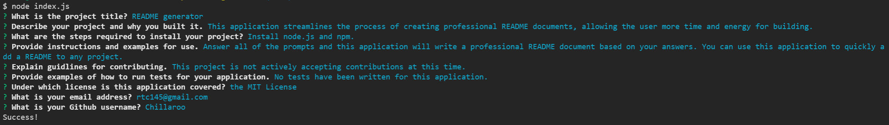

# README generator

## Description 
This application streamlines the process of creating professional README documents, allowing the user more time and energy for building.

## Table of Contents

1. [Installation](#installation)
2. [Usage](#usage)
3. [License](#license)
4. [Contributing](#contributing)
5. [Tests](#tests)
6. [Questions](#questions)

## Installation
Install node.js and npm. Then, clone this repo.

## Usage
Answer all of the prompts and this application will write a professional README document based on your answers. You can use this application to quickly add a README to any project. 

When you run this application, you should see the prompts shown in the screenshot below.

A video demo is linked here: https://drive.google.com/file/d/1Th4NvQVQ_gZQRrNFSONBcCZlQ8zhJj2y/view.

## License
This application is covered under the MIT License.

## Contributing
This project is not actively accepting contributions at this time.

## Tests
No tests have been written for this application.

## Questions
You can reach me with questions at rtc145@gmail.com or view my github page at https://github.com/Chillaroo.
    